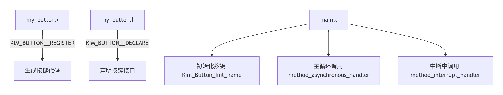
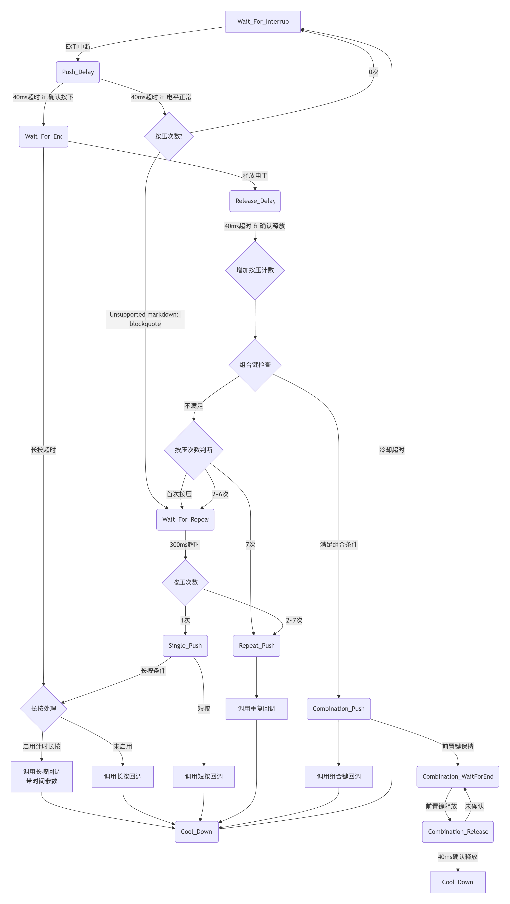

# STM32-SimpleButton

**Simple** and tiny STM32 key(button) frame, compatible with the STM32 HAL library, which offer **short-press/long-press/repeat-press/combination-press** for each button, non-blocking.

一个单文件的STM32按键框架，**5行代码**完成按键部署，适配STM32 HAL库，支持每个按键独立的 **短按/长按/多击/组合键**，采用外部中断加循环内异步处理，非阻塞状态机。

---

## VERSION  -  *0.2.0s-Stable*

---

- [中文](#chinese)
  
  - [简介](#简介)
  - [使用方法](#使用方法)
  - [动态设置](#动态设置)
  - [注意事项](#注意事项)
  - [自定义选项（宏）](#自定义选项宏)
  - [状态机图解](#状态机图解)

- [English](#english)
  
  - [brief-introduction](#brief-introduction)
  - [how-to-use](#how-to-use)
  - [dynamic-settings](#dynamic-settings)
  - [note-attention](#note)
  - [customizable-options-macro](#customizable-options-macro)

- [START-NOW 立刻开始](#start-now-立刻开始)

---

## Chinese <span id="chinese"> </span>



### 简介：

* 本项目仅含**一个**文件，即 `kim_stm32_hal_button.h` 。只需要使用一个宏定义即可生成全部所需代码。
  
#### 新增功能特性(版本-0.2.0)：

+ 🛠 **修复低功耗进入函数临界区**：使得低功耗进入部分原子化，规避错误休眠风险

#### 已有功能特性：

+ ✅ **仅含头文件**：该项目仅含`kim_stm32_hal_button.h`一个头文件，不含任何`.c`文件

+ ✅ **按键事件完善**：支持 短按、长按/[计时长按](#long_push_timing_example_zh_)[[开启](#enable_disable_options_zh_)]、双击/[计数多击](#repeat_button_example_zh_)[[开启](#enable_disable_options_zh_)]、[组合键](#combination_button_example_zh_)[[开启](#enable_disable_options_zh_)]

+ ✅ **状态机**：非阻塞软件消抖，对引脚状态二次确认，异步处理代码

+ ✅ **低功耗支持**：支持按键空闲时进入[低功耗模式](#low_power_example_zh_),支持自定义[低功耗进入函数](#functions_hooks_zh_)

+ ✅ **外部中断**：按键采用外部中断触发，保证按键请求不会因轮询阻塞被忽略

+ ✅ **动态回调**：每个按键短按、长按/计时长按、双击/计数多击支持独立的回调函数动态注册，回调函数允许为空

+ ✅ **零开销原则**：对于没有使用的特性(例如组合键)，不产生任何额外的开销

+ ✅ **内存精简**：数据结构紧凑，内存占用少

+ ✅ **多编译器支持**：支持GCC与ArmCC等编译器

+ ✅ **临界区保护**：多线程数据安全、不冲突，理论支持操作系统

+ ✅ **调试模式**：[开启](#enable_disable_options_zh_)调试模式后可以设置[错误钩子](#functions_hooks_zh_)，精准锁定异常

+ ✅ **按键定制**：支持每个按键单独设置各个判定时间

### 使用方法：

* 首先，假设我们有三个文件（`main.c` , `my_button.c` , `my_button.h` ）。其中，my_button.c 文件存放按键代码，my_button.h 文件存放必要的声明，main.c 调用代码。

```
.
|
+-- kim_stm32_hal_button.h 本项目提供的头文件
|
+-- my_button.c (#include "kim_stm32_hal_button.h") 用户自建文件，用于定义按键
|
+-- my_button.h (#include "kim_stm32_hal_button.h") 用户自建文件，用于声明按键
|
+-- main.c (#include "my_button.h") 用户自建文件，用于调用按键

```

* 然后，在 `my_button.c` 中，先引入头文件`kim_stm32_hal_button.h`，使用 **KIM_BUTTON__REGISTER** 宏 来生成所需要的代码。（示例如下： 我的按钮触发时会在 **PA7** 产升**下降沿** 信号， 我想给按钮取名为**myButton**  ）

```c
/* 以下是 my_button.c 内容 */
#include "kim_stm32_hal_button.h" // 包含头文件

// 依次为            端口基地址    引脚编号       触发边沿选择       按键名称 
KIM_BUTTON__REGISTER(GPIOA_BASE, GPIO_PIN_7, EXTI_TRIGGER_FALLING, myButton) // 注意不用加 ;

```

* 接着，在 `my_button.h` 中，先引入头文件`kim_stm32_hal_button.h`，使用 **KIM_BUTTON__DECLARE** 宏 来生成必要的声明信息。（注意： 声明的按钮名称必须是 **KIM_BUTTON__REGISTER** 宏 定义过的）

```c
/* 以下是 my_button.h 内容 */
#pragma once
#include "kim_stm32_hal_button.h" // 包含头文件

// 按钮名称必须与 my_button.c 中保持一致
KIM_BUTTON__DECLARE(myButton) // 注意不用加 ;

```

* 最后，在 `main.c` 中，引入头文件 `my_button.h` ，准备好回调函数，然后在三处调用三个函数即可。示例与详细说明如下：

```c
/* 以下是 main.c 内容 */
/* ... */
#include "my_button.h"

// 短按回调函数，按键短按后会执行它 (函数名随意，类型必须是 void(*)(void))
void short_push_callback(void) { ... }

// 长按回调函数，长按后会执行它 (函数名随意，类型必须是 void(*)(void))
void long_push_callback(void) { ... }

// 双击回调函数，双击后会执行它 (函数名随意，类型必须是 void(*)(void))
void double_push_callback(void) { ... }

int main(void)
{
    /* ... 其他无关代码 ... */

    // 【第一处】：在 while 循环之前，调用初始化函数。初始化函数名称为 Kim_Button_Init_ 加上你自定义的按键名。
    //     例如：我在my_button.c和my_button.h中还定义了一个按键，名叫 ABC，
    //     那么此处我应该再调用一个函数 Kim_Button_Init_ABC()
    Kim_Button_Init_myButton();

    while(1)
    {
        /* ... 其他无关代码 ... */

        // 【第二处】：在while循环当中调用异步处理函数，调用的方法类似成员函数，依次传入 短/长/双 按回调函数。
        //     补充： （Kim_Button_ 加上 按钮名称） 这个结构体是全局变量，我们通过它调用函数。
        //     如果不需要某个回调函数，可以传入NULL。
        Kim_Button_myButton.method_asynchronous_handler(
            short_push_callback, // 如果不需要，可以填NULL
            long_push_callback,  // 如果不需要，可以填NULL
            double_push_callback  // 如果不需要，可以填NULL
        );

        /* ... 其他无关代码 ... */
    }
}

// 【第三处】：在相应的中断回调函数中使用按键的中断处理函数
//        如果你使用了 STM32CubeMX 生成了 NVIC 对应代码，可以在 HAL_GPIO_EXTI_Callback()函数中调用
//        如果没有使用 STM32CubeMX 生成对应中断代码，则需要在 EXTI?_IRQHandler()函数中调用(? 为0~4，9_5或15_10)
//        下面演示两种写法

// 第三处-写法一：
void HAL_GPIO_EXTI_Callback(uint16_t GPIO_Pin)
{
     /* ... 其他无关代码 ... */
    if(GPIO_Pin == GPIO_PIN_7) // 假设我的按钮链接的是 PA7
    {
        // 调用按键的中断处理函数
        Kim_Button_myButton.method_interrupt_handler();
    }
     /* ... 其他无关代码 ... */
}

// 第三处-写法二：（可以尝试在stm32_xxxx_it.c文件中找一下这个回调函数，如果没有就自己写）
void EXTI7_IRQHandler(void) // 假设我的按钮链接的是 PA7
{
     /* ... 其他无关代码 ... */
    if(__HAL_GPIO_EXTI_GET_IT(GPIO_PIN_7) != 0)
    {
        // 调用按键的中断处理函数
        Kim_Button_myButton.method_interrupt_handler();
        __HAL_GPIO_EXTI_CLEAR_IT();
    }
     /* ... 其他无关代码 ... */
}
```

* 【可选功能】计时长按 <span id="long_push_timing_example_zh_"> </span>

```c
/***** Macro to enable different long push time *****/
// 找到这个宏，将它的值修改为 1，长按功能会升级为定时长按，长按回调函数将接收长按时间作为参数。
#define KIM_BUTTON_ENABLE_DIFFERENT_TIME_LONG_PUSH  1

// 准备好带 uint32_t 参数的长按回调函数（名字随意）
// 该参数会接受实际的按键按下的时间(存在误差，与一轮while循环用时相近)
void long_push_callback(uint32_t long_push_tick)
{
    if(long_push_tick < 3000) {
        /* 1~3 s */
    }
    else if(long_push_tick < 10000) {
        /* 3~10 s */
    }
    else {
        /* > 10 s */
    }
}

int main(void)
{
    /* ... */
    Kim_Button_Init_myButton(); // 与一般情况一致

    while(1)
    {
        Kim_Button_myButton.method_asynchronous_handler(
            ...， // 与一般情况一致
            long_push_callback,  // 如果不需要，可以填NULL
            ...  // 与一般情况一致
        );
    }
}

void HAL_GPIO_EXTI_Callback(uint16_t GPIO_Pin)
{
     /* ... 其他无关代码 ... */
    if(GPIO_Pin == GPIO_PIN_7) 
    {
        // 与一般情况一致
        Kim_Button_myButton.method_interrupt_handler();
    }
     /* ... 其他无关代码 ... */
}
```

* 【可选功能】组合按键 <span id="combination_button_example_zh_"> </span>
  * 本项目支持简单的组合键，基本原理是为**当前按键**(button-[this])设置“前置按键”与“组合回调函数”。当前置按键处于按下状态时，按下**当前按键**触发组合回调函数。

```c
/***** Macro to enable button combination *****/
// 找到这个宏，将它的值修改为 1
#define KIM_BUTTON_ENABLE_BUTTON_COMBINATION        0

// 组合键回调函数（名称随意，但必须无参无返回值）
void CombinationCallBack(void)
{
    /* ... */
}

int main(void)
{
    Kim_Button_Init_KEY1();
    Kim_Button_Init_KEY2();

    // 假设我要设置组合键：在KEY1按下期间，KEY2按下并释放后会调用 CombinationCallBack
    // 以下配置必须在初始化函数之后
    Kim_Button_KEY2.public_comb_before_button = &Kim_Button_KEY1; // KEY2的前置按键是KEY1
    Kim_Button_KEY2.public_comb_callback = CombinationCallBack;

    while(1)
    {
        Kim_Button_KEY1.method_asynchronous_handler(...);// 与一般情况一致
        Kim_Button_KEY2.method_asynchronous_handler(...);// 与一般情况一致
    }
}


void HAL_GPIO_EXTI_Callback(uint16_t GPIO_Pin)
{
     /* ... 其他无关代码 ... */
    if(...) 
    {
        // 与一般情况一致
        Kim_Button_KEY1.method_interrupt_handler();
    }
    else if(...)
    {
        // 与一般情况一致
        Kim_Button_KEY2.method_interrupt_handler();
    }
     /* ... 其他无关代码 ... */
}
```

* 【可选功能】多击按键 <span id="repeat_button_example_zh_"> </span>
  * 开启该功能后，双击按键回调函数将变为多击按键回调函数，类型由 `void (*)(void)` 变为 `void (*)(uint8_t)` 。该参数会接收多击按键次数（2 ~ 7次）。示例如下：

```c

/***** Macro to enable button repeat(2 ~ 7) *****/
// 找到这个宏，将它的值修改为 1
#define KIM_BUTTON_ENABLE_BUTTON_MORE_REPEAT        1

// 多击回调函数
void repeat_push_callback(uint8_t push_time)
{
    switch(push_time)
    {
    case 2: ... break;
    case 3: ... break;
    case 4: ... break;
    ...
    case 7: ... break;
    }
}

// 主循环和中断中正常调用 method_asynchronous_handler 与 method_interrupt_handler。
// 只需要在调用 XXX.method_asynchronous_handler(..., ..., repeat_push_callback) 第三个参数填多击回调（而非普通模式的双击回调）即可。

```

* 【可选功能】低功耗 <span id="low_power_example_zh_"> </span>

```c

int main(void)
{
  while(1)
  {
    /* 其他内容正常书写，在while循环恰当位置调用这样一个宏函数 */
    /* 参数为：所有按键的“状态结构体变量”(Kim_Button_ + 按键名)。 参数是可变数量的。 */
    KIM_BUTTON__LOW_POWER(Kim_Button_myButton1, Kim_Button_myButton2, Kim_Button_myButton3);
  }
}

```


### 动态设置：

* 可以在代码中为每个按键设置独立的长按判定时间，示例如下：

```c
// 先初始化
Kim_Button_Init_myButton();

// 将 myButton 按键的长按判定时间延长至3000ms(改设置必须在 Init 函数之后)
Kim_Button_myButton.public_long_push_min_time = 3000;
```

+ 可以在代码中为每个按键设置独立的冷却时间，示例如下：

```c
// 先初始化
Kim_Button_Init_myButton();

Kim_Button_myButton.public_cool_down_time = 5000; // 每5s才能触发一次
```

+ 可以在代码中为每个按键设置独立的双击判定时间，示例如下：

```c
// 先初始化
Kim_Button_Init_myButton();

Kim_Button_myButton.public_double_push_max_time = 0; // 不等待双击/多击判定（减少短按响应延迟，放弃双击功能）
```


### 注意事项：

* ~~使用了SysTick，可能会与HAL_Delay冲突。【默认设置下不冲突】~~ （v0.0.5后完全不冲突）

* 每一个EXTI端口号只能有一个按钮，也就是说PA3与PB3不能同时作为按钮引脚。
  
  

### 自定义选项（宏）：

* 在`kim_stm32_hal_button.h`文件的一开头，有一些可以修改的宏定义，也可以称之为自定义选项。可以根据项目需要更改这些宏定义的值。这些宏选项有以下几个部分：
  
  * [头文件选择](#header_file_choice_zh_)
  * [时间设置](#time_config_zh_)
  * [中断优先级设置](#NVIC_priority_zh_)
  * [启动/禁用-选项](#enable_disable_options_zh_)
  * [函数与钩子](#functions_hooks_zh_)
  * [名字空间/命名前缀](#namespace_nameprefix_zh_)

* **头文件选择** <span id="header_file_choice_zh_"> </span>
  
  * 根据芯片型号选择合适的头文件，取消对应的注释。

```c

/** @p ------------------------------------------------------------- */
/** @b HEADER-FILES */

/***** @headerfile Select one of the header files given below as needed *****/
// 根据芯片型号选择合适的头文件，取消对应的注释。
# include "stm32f1xx_hal.h"
// # include "stm32f2xx_hal.h"
// # include "stm32f3xx_hal.h"
// # include "stm32f4xx_hal.h"
// # include "stm32h4xx_hal.h"

```

* **时间设置** <span id="time_config_zh_"> </span>
  * 设置各个时间参数，作为**默认值**（每个按键可以分别动态修改）

```c

/** @p ------------------------------------------------------------- */
/** @b ENABLE-DISABLE-OPTIONS */

/***** time config(配置各种时间) *****/
/* one tick(one interrupt = 1ms) (默认SysTick中断间隔为1ms) */
#define KIM_BUTTON_SYSTICK_ONE_TICK                 (SystemCoreClock / (1000UL / HAL_TICK_FREQ_DEFAULT))
/* calculate the tick with the time(计算宏，由于一次中断计数是1ms，此处tick == time) */
#define KIM_BUTTON_TIME_MS(_xx_ms)                  (1 * (uint32_t)(_xx_ms))

// 按下按键后，延时（非阻塞）用于消抖的时间
#define KIM_BUTTON_PUSH_DELAY_TIME                  KIM_BUTTON_TIME_MS(40)          /* 40 ms */

// 松开按键后，判定双击/多击的窗口时间。在此期间再次按下，判定为双击/多击。
#define KIM_BUTTON_REPEAT_PUSH_MAX_TIME             KIM_BUTTON_TIME_MS(300)         /* 300 ms */

// 长按判定的最小时间，超过这个时间就判定为长按
#define KIM_BUTTON_LONG_PUSH_MIN_TIME               KIM_BUTTON_TIME_MS(1000)        /* 1000 ms */

// 松开按键后，延时（非阻塞）用于消抖的时间
#define KIM_BUTTON_RELEASE_DELAY_TIME               KIM_BUTTON_TIME_MS(40)          /* 40 ms */

// 按键功能执行完毕后的冷却时间
#define KIM_BUTTON_COOL_DOWN_TIME                   KIM_BUTTON_TIME_MS(0)           /* 0 ms */

// 按下保持的最大时间，超过就恢复 Wait_For_Interrupt，或进入ERROR_HOOK(DEBUG模式)
#define KIM_BUTTON_SAFE_PUSH_MAX_TIME               KIM_BUTTON_TIME_MS(60000)       /* 1 min */

```

* **中断优先级设置** <span id="NVIC_priority_zh_"> </span>
  * 设置对应的中断优先级。如果使能了 KIM_BUTTON_STM32CUBEMX_GENERATE_* 宏选项，该参数无效。

```c

/** @p ------------------------------------------------------------- */
/** @b NVIC-PRIORITY */

/***** NVIC Priority config *****/

// SysTick 抢占优先级，默认情况下与 HAL库 设置一致，即 TICK_INT_PRIORITY
#define KIM_BUTTON_NVIC_SYSTICK_PreemptionPriority  TICK_INT_PRIORITY

// SysTick 响应优先级，永远保持0，该宏已弃用！
#define KIM_BUTTON_NVIC_SYSTICK_SubPriority         0   /* this macro is not in use */

// EXTI 抢占优先级
#define KIM_BUTTON_NVIC_EXTI_PreemptionPriority     0

// EXTI 响应优先级
#define KIM_BUTTON_NVIC_EXTI_SubPriority            0

```

* **启动/禁用-选项** <span id="enable_disable_options_zh_"> </span>
  * 设置下面这些宏定义的值(0/1)，可以使能或失能对应功能/模式。

```c

/** @p ------------------------------------------------------------- */
/** @b ENABLE-DISABLE-OPTIONS */

/* If this macro is 1, then the TIME above cannot be configured separately for each button */
// 如果这个宏是1，那么上面的TIME不能为每个按钮单独配置（但更节省RAM）
#define KIM_BUTTON_ONLY_USE_DEFAULT_TIME            0

/***** If you use STM32CubeMX to generate code, define follow macro as @c 1 ,   *****
 ***** otherwise define follow macro as @c 0 .                                  *****/
/* 如果你使用STM32CubeMX生成了相关代码，请将下方对应的宏定义值改为1，可以减少重复代码 */
/* 如果不确定，可以先保持宏定义为0，测试通过后，再改为1，查看效果是否改变 */
#define KIM_BUTTON_STM32CUBEMX_GENERATE_SYSTICK     0 // 如果 CubeMX生成了SysTick相关代码，宏改为1
#define KIM_BUTTON_STM32CUBEMX_GENERATE_EXTI        0 // 如果 CubeMX生成了EXTI相关代码，宏改为1
#define KIM_BUTTON_STM32CUBEMX_GENERATE_NVIC        0 // 如果 CubeMX生成了NVIC相关代码，宏改为1

/***** Macro for use debug mode *****/
// 将宏的值设置为1可以启动调试模式
#define KIM_BUTTON_USE_DEBUG_MODE                   0   /* 1 --> use debug mode */

/***** Macro for noinline state machine(Kim_Button_PrivateUse_AsynchronousHandler) function *****/
// 当宏设置为 1 时，状态机函数不内联，可以大幅降低ROM占用，但可能会减慢函数调用速度
#define KIM_BUTTON_NO_INLINE_STATE_MACHINE          0

/***** Macro to enable different long push time *****/
// 当宏设置为 1 时，开启计时长按功能
// 长按回调函数会传入一个 uint32_t 类型的参数，记录着长按的tick数
#define KIM_BUTTON_ENABLE_DIFFERENT_TIME_LONG_PUSH  0

/***** Macro to enable button combination *****/
// 当宏设置为 1 时，开启组合键功能
// 需要使用 Kim_Button_name.public_comb_before_button = &(先按下的按键); 绑定先按下的按键
// 与 Kim_Button_name.public_comb_callback = callback_func; 绑定回调函数
#define KIM_BUTTON_ENABLE_BUTTON_COMBINATION        0

/***** Macro to enable button repeat(2 ~ 7) *****/
// 当宏为 1 时，开启计数多击功能
// 支持至多 7 次的多击检测（多击次数会作为参数传入回调函数）。为 0 时只支持双击，回调函数无参。
#define KIM_BUTTON_ENABLE_BUTTON_MORE_REPEAT        0

```

* **函数与钩子** <span id="functions_hooks_zh_"> </span>
  * 设置下面这些宏函数，定制代码行为。例如自定义的 DEBUG_ERROR_HOOK 可在调试模式出现异常时被调用。

```c

/** @p ------------------------------------------------------------- */
/** @b FUNCTIONS-HOOKS */

/***** Critical Zone *****/
/* define follow macro when multi-thread */
// 多线程下需要保护的临界区，单线程下可以注释掉
#define KIM_BUTTON_CRITICAL_ZONE_BEGIN()            do { __disable_irq(); } while(0U)
#define KIM_BUTTON_CRITICAL_ZONE_END()              do { __enable_irq(); } while(0U)

/* define follow macro any time */
// 单线程与多线程都必须保护的临界区，不建议修改
#define KIM_BUTTON_ALWAYS_CRITICAL_ZONE_BEGIN()     do { __disable_irq(); } while(0U)
#define KIM_BUTTON_ALWAYS_CRITICAL_ZONE_END()       do { __enable_irq(); } while(0U)

/***** Macro for debug hook *****/
/* ... can be your function ... */
// DEBUG 模式下出现异常时会调用的函数，可自定义
#define KIM_BUTTON_DEBUG_ERROR_HOOK()               do { while(1) {} } while(0U)

/***** Macro for get tick *****/
// 未来扩展使用，不建议修改
#define KIM_BUTTON_GET_TICK()                       HAL_GetTick()

/***** Macro for GPIO read pin *****/
// 未来扩展使用，不建议修改
#define KIM_BUTTON_READ_PIN(GPIOx_BASE, PIN)        HAL_GPIO_ReadPin((GPIO_TypeDef*)(GPIOx_BASE), PIN)

/***** Macro to stat low power mode *****/
// 进入低功耗模式的宏函数，可自定义
#define KIM_BUTTON_START_LOW_POWER()                do { __WFI(); } while(0U)

```

* **名字空间-命名前缀** <span id="namespace_nameprefix_zh_"> </span>
  * 自定义设置暴露(extern)的内容的命名前缀，包括按键名前缀和初始化函数前缀。

```c

/** @p ------------------------------------------------------------- */
/** @b NAMESPACE-NAME-PREFIX */

/***** @namespace Name Prefix *****/
/** If you change this macro, you need to use `new_prefix + Init_ + button_name()`      **
 ** to initialize the button, and use `new_prefix + button_name` struct to use method.  **
 **                                                                                     **
 ** @example                                                                            **
 **     #define KIM_BUTTON_NAME_PREFIX         KEY_                                     **
 **     KIM_BUTTON__REGISTER(..., ..., ..., THE_NAME)                                   **
 **                                                                                     **
 **     Then I need to use `KEY_Init_THE_NAME()` to initialize the button, and use      **
 **     `KEY_THE_NAME.method_asynchronous_handler(..., ..., ...)` and                   **
 **     `KEY_THE_NAME.method_interrupt_handler()`                                       **/
// 这个宏定义是用来自定义前缀的，默认为Kim_Button_。如果修改为KEY_，那么在main.c使用的时候
// 就要使用 `KEY_Init_##__name()` 函数初始化，而非使用默认的 `Kim_Button_Init_##__name()`
// 相应的，也应该使用 KEY_##__name.method_asynchronous_handler(..., ..., ...) 以及
// KEY_##__name.method_interrupt_handler()
#define KIM_BUTTON_NAME_PREFIX                      Kim_Button_

```

### 状态机图解

* **正常电平**指的是按键未被按下时的电平



- [返回顶部](#stm32-simplebutton)
  
  

## English <span id="english"> </span>

(PS: Because of the machine translation, you may see words "key" and "button". They mean the same in this project.)

### Brief introduction:

* This project contains only one file, namely `kim_stm32_hal_button.h` . All the required code can be generated simply by using one macro definition.
  
#### New Features(Version-0.2.0):

+ 🛠 **Fix low-power entry function**: Make low power consumption partially atomized to avoid the risk of incorrect sleep 

#### Existing Features:

+ ✅ **Header-only**: just include `kim_stm32_hal_button.h`, no `.c` file needed

+ ✅ **Rich Press Event**: Supports short-push, long-push/[timing-long-push](#long_push_timing_example)[[ENABLE](#enable_disable_options)], double-push/[repeat-counter-push](#repeat_button_example)[[ENABLE](#enable_disable_options)], [button-combination](#combination_button_example)[[ENABLE](#enable_disable_options)]

+ ✅ **State Machine**: Non-blocking software debouncing, secondary confirmation of pin status, and asynchronous code processing

+ ✅ **Low Power Support**：Support entering [Low power mode](#low_power_example) when the buttons are idle, Support custom [low-power entry function](#functions_hooks)

+ ✅ **Use EXTI**: The buttons are triggered by external interrupts to ensure that button requests will not be ignored due to polling blocking

+ ✅ **Dynamic Callback**: Each button short press, long press/timer long press, double-click/count multiple press supports independent callback function dynamic registration, and the callback function is allowed to be empty

+ ✅ **Zero Overhead**: For features that are not used (such as combination buttons), no additional overhead is incurred

+ ✅ **Memory Reduction**: The data structure is compact and the memory usage is low

+ ✅ **Support Multiple Compilers**: It supports GCC and ArmCC compilers

+ ✅ **Critical Section Protection**: Multi-threaded data is secure and conflict-free

+ ✅ **DEBUG Mode**: After enabling the debug mode, error hooks can be set to precisely lock onto anomalies

+ ✅ **Customized Buttons**: Support setting each judgment time separately for each button

### How to use: 

* First, suppose we have three files (`main.c `, `my_button.c`, `my_button.h`). Among them, the `my_button.c` file stores the button codes, the `my_button.h` file stores the necessary declarations, and the `main.c` call code.

* Then, in `my_button.c`, first import the header file `kim_stm32_hal_button.h`, and use the **KIM_BUTTON__REGISTER** macro to generate the required code. (Example: When my button is triggered, it will produce a falling edge signal at **PA7**. I want to name the button **myButton**. The code is as follows: )
  
  ```c
  /* The following is the content of my_button.c */ 
  #include "kim_stm32_hal_button.h" // Include header files
  
  // The sequence is port base address, pin number, trigger edge selection, and button(key) name(up to you)
  KIM_BUTTON__REGISTER(GPIOA_BASE, GPIO_PIN_7, EXTI_TRIGGER_FALLING, myButton) // Note: No need to add ;
  ```
  
  

* Next, in `my_button.h`, first import the header file `kim_stm32_hal_button.h`, and use the **KIM_BUTTON__DECLARE** macro to generate the necessary declaration information. (Note: The declared button name must be defined by the **KIM_BUTTON__REGISTER** macro)
  
  ```c
  /* The following is the content of my_button.h */ 
  #pragma once 
  #include "kim_stm32_hal_button.h" // Include header files
  
  // The button name must be consistent with that in my_button.c
  KIM_BUTTON__DECLARE(myButton) // Note: No need to add ;
  ```

* Finally, in `main.c`, import the header file `my_button.h`, prepare the callback function, and then call the three functions in three places. Examples and detailed explanations are as follows:
  
  

```c
/* The following is the content of main.c */ 
/* ... */
#include "my_button.h" 

// Callback function of short press. After shor pressing, it will be executed (the function name is arbitrary)
void short_push_callback(void) { ... } 

// Callback function of long press. After long pressing, it will be executed (the function name is arbitrary).
void long_push_callback(void) { ... } 

// Callback function of double press. After double pressing, it will be executed (the function name is arbitrary).
void double_push_callback(void) { ... } 

int main(void) 
{
  /* ... Other irrelevant code ... */

  // 【 First Place 】 : Call the initialization function before the while loop. The name of the initialization function is Kim_Button_Init_ plus the key(button) name you defined.
  //     For example: I also defined a key named ABC in my_button.c and my_button.h.
  //     Then here I should call another function, Kim_Button_Init_ABC()
  Kim_Button_Init_myButton();

  while(1)
  {
      /* ... Other irrelevant code ... */

      // 【 Second Point 】 : In a while loop, an asynchronous processing function is called. The method of the call is similar to a member function, and short/long/double-press callback functions are passed in sequence.
      //     Supplementary: (Kim_Button_ plus the button name) This structure is a global variable, and we call functions through it.
      //     If a certain callback function is not needed, NULL can be passed in.
      Kim_Button_myButton.method_asynchronous_handler(
          short_push_callback， // If not needed, NULL can be filled in
          long_push_callback，  // If not needed, NULL can be filled in
          double_push_callback  // If not needed, NULL can be filled in
      );

      /* ... Other irrelevant code ... */
  }

} 
// 【 Third Point 】 : Use the interrupt handling function of the key in the corresponding interrupt callback function
// If you have generated the corresponding code for NVIC using STM32CubeMX, you can call it in the HAL_GPIO_EXTI_Callback() function
// If the corresponding interrupt code is not generated using STM32CubeMX, it needs to be called in the EXTIx_IRQHandler() function (x is 0~ 4,9 _5 or 15_10).
// The following demonstrates two writing methods

// Writing Method One:
void HAL_GPIO_EXTI_Callback(uint16_t GPIO_Pin) {
   /* ... Other irrelevant code ... */
  if(GPIO_Pin == GPIO_PIN_7) // Suppose my button is linked to PA7
  {
      // Call the interrupt handling function of the key
      Kim_Button_myButton.method_interrupt_handler();
  }
   /* ... Other irrelevant code ... */
} 

// Writing Method Two: (You can try to find this callback function in the stm32_xxxx_it.c file. If it's not available, write it yourself.
void EXTI7_IRQHandler(void) // Suppose my button is linked to PA7
{
   /* ... Other irrelevant code ... */
  if(__HAL_GPIO_EXTI_GET_IT(GPIO_PIN_7) != 0)
  {
      // Call the interrupt handling function of the key
      Kim_Button_myButton.method_interrupt_handler();
      __HAL_GPIO_EXTI_CLEAR_IT();
  }
   /* ... Other irrelevant code ... */
}
```

* **[optional function]** Long press for timing

```c
/***** Macro to enable different long push time *****/
// Find this macro and modify its value to 1
#define KIM_BUTTON_ENABLE_DIFFERENT_TIME_LONG_PUSH  1

// Prepare the long-press callback function with the uint32_t parameter (the name is arbitrary)
// This parameter will accept the actual time when the key is pressed (with an error, similar to the time taken for one while loop).
void long_push_callback(uint32_t long_push_tick)
{
    if(long_push_tick < 3000) {
        /* 1~3 s */
    }
    else if(long_push_tick < 10000) {
        /* 3~10 s */
    }
    else {
        /* > 10 s */
    }
}

int main(void)
{
    /* ... */
    Kim_Button_Init_myButton(); // Consistent with the general situation

    while(1)
    {
        Kim_Button_myButton.method_asynchronous_handler(
            ..., // Consistent with the general situation
            long_push_callback,  // If not needed, NULL can be filled in
            ...  // Consistent with the general situation
        );
    }
}

void HAL_GPIO_EXTI_Callback(uint16_t GPIO_Pin)
{
     /* ... Other irrelevant code ... */
    if(GPIO_Pin == GPIO_PIN_7) 
    {
        // Consistent with the general situation
        Kim_Button_myButton.method_interrupt_handler();
    }
     /* ... Other irrelevant code ... */
}
```

* **[optional function]** button combination

```c
/***** Macro to enable button combination *****/
// Find this macro and modify its value to 1
#define KIM_BUTTON_ENABLE_BUTTON_COMBINATION        0

// Composite key callback function (name is arbitrary, but must have no parameters and no return value)
void CombinationCallBack(void)
{
    /* ... */
}

int main(void)
{
    Kim_Button_Init_KEY1();
    Kim_Button_Init_KEY2();

    // Suppose I want to set the combination key: during the period when KEY1 is pressed, the combination callback will be called after KEY2 is pressed and released
    // The following configuration must be after the initialization function
    Kim_Button_KEY2.public_comb_before_button = &Kim_Button_KEY1; // The front button of KEY2 is KEY1
    Kim_Button_KEY2.public_comb_callback = CombinationCallBack;

    while(1)
    {
        Kim_Button_KEY1.method_asynchronous_handler(...);// Consistent with the general situation
        Kim_Button_KEY2.method_asynchronous_handler(...);// Consistent with the general situation
    }
}


void HAL_GPIO_EXTI_Callback(uint16_t GPIO_Pin)
{
     /* ... Other irrelevant code ... */
    if(...) 
    {
        // Consistent with the general situation
        Kim_Button_KEY1.method_interrupt_handler();
    }
    else if(...)
    {
        // Consistent with the general situation
        Kim_Button_KEY2.method_interrupt_handler();
    }
     /* ... Other irrelevant code ... */
}
```

* **[optional function]** button repeat
  * After enabling this function, the double-click key callback function will change to a multi-click key callback function, and its type will change from `void (*)(void)` to `void (*)(uint8_t)`. This parameter will receive multiple keystrokes (2 to 7 times). For example:

```c

/***** Macro to enable button repeat(2 ~ 7) *****/
// Find this macro and modify its value to 1
#define KIM_BUTTON_ENABLE_BUTTON_MORE_REPEAT        1

// multi-push callback function
void repeat_push_callback(uint8_t push_time)
{
    switch(push_time)
    {
    case 2: ... break;
    case 3: ... break;
    case 4: ... break;
    ...
    case 7: ... break;
    }
}

// method_asynchronous_handler and method_interrupt_handler are called normally in the main loop and interrupts.
// Just call XXX.method_asynchronous_handler(..., ..., repeat_push_callback), For the third parameter of "repeat_push_callback", fill in the multi-click callback (instead of the double-click callback in the normal mode).


```

* **[optional function]** Low Power <span id="low_power_example"> </span>

```c

int main(void)
{
  while(1)
  {
    /* Write the other content normally and call such a macro function at an appropriate position in the while loop */
    /* The parameter is: the "state structure variable" of all buttons (Kim_Button_ + button name). The parameters are of a variable number. */
    KIM_BUTTON__LOW_POWER(Kim_Button_myButton1, Kim_Button_myButton2, Kim_Button_myButton3);
  }
}

```


### Dynamic settings:

* You can set an independent long-press determination time for each key in the code. An example is as follows:

```c
// Initialize first
Kim_Button_Init_myButton();

// Extend the long-press determination time of the myButton key to 3000ms(this setting must be changed after the Init function).
Kim_Button_myButton.public_long_push_min_time = 3000;
```

+ An independent cooldown time can be set for each key in the code. An example is as follows:

```c
// Initialize first
Kim_Button_Init_myButton();

Kim_Button_myButton.public_cool_down_time = 5000; // It can only be triggered once every 5 seconds
```

+ You can set an independent double-click determination time for each key in the code. An example is as follows:

```c
// Initialize first
Kim_Button_Init_myButton();

Kim_Button_myButton.public_double_push_max_time = 0; // Do not wait for double-click determination (reduce the response delay of short presses and abandon the double-click function)
```

### Note：

* ~~SysTick is used, which may conflict with HAL Delay(). [There is no conflict under the default Settings]~~ (After v0.0.5, there is no conflict)

* Each EXTI port number can only have one button, which means that PA3 and PB3 cannot be used as button pins simultaneously.
  
  

### Customizable options (Macro):

* At the beginning of the `kim_stm32_hal_button.h` file, there are some macro definitions that can be modified, which can also be called custom options. The values defined by these macros can be changed according to the project requirements. These macro options have the following parts:
  
  * [Header-File-Choice](#header_file_choice)
  * [Time-Config](#time_config)
  * [NVIC-Priority](#NVIC_priority)
  * [Enable-Disable-Options](#enable_disable_options)
  * [Functions-Hooks](#functions_hooks)
  * [Namespace-Nameprefix](#namespace_nameprefix)

* **Header-File-Choice** <span id="header_file_choice"> </span>
  
  * Select the appropriate header file based on the chip model and remove the "//".

```c

/** @p ------------------------------------------------------------- */
/** @b HEADER-FILES */

/***** @headerfile Select one of the header files given below as needed *****/
# include "stm32f1xx_hal.h"
// # include "stm32f2xx_hal.h"
// # include "stm32f3xx_hal.h"
// # include "stm32f4xx_hal.h"
// # include "stm32h4xx_hal.h"

```

* **Time-Config** <span id="time_config"> </span>
  * Set each time parameter as the "default value" (each button can be dynamically modified separately)

```c

/** @p ------------------------------------------------------------- */
/** @b ENABLE-DISABLE-OPTIONS */

/***** time config *****/
/* one tick(one interrupt = 1ms) */
#define KIM_BUTTON_SYSTICK_ONE_TICK                 (SystemCoreClock / (1000UL / HAL_TICK_FREQ_DEFAULT))
/* calculate the tick with the time */
#define KIM_BUTTON_TIME_MS(_xx_ms)                  (1 * (uint32_t)(_xx_ms))

// The delay (non-blocking) used for debouncing after pressing the key
#define KIM_BUTTON_PUSH_DELAY_TIME                  KIM_BUTTON_TIME_MS(40)          /* 40 ms */

// After releasing the key, determine the window time for double-clicking. If you press again during this period, it will be judged as a double-click.
#define KIM_BUTTON_REPEAT_PUSH_MAX_TIME             KIM_BUTTON_TIME_MS(300)         /* 300 ms */

// The minimum duration for long press determination. If it exceeds this time, it will be determined as a long press
#define KIM_BUTTON_LONG_PUSH_MIN_TIME               KIM_BUTTON_TIME_MS(1000)        /* 1000 ms */

// The delay (non-blocking) used for debouncing after releasing the key
#define KIM_BUTTON_RELEASE_DELAY_TIME               KIM_BUTTON_TIME_MS(40)          /* 40 ms */

// CD time for button
#define KIM_BUTTON_COOL_DOWN_TIME                   KIM_BUTTON_TIME_MS(0)           /* 0 ms */

// Press the maximum holding time. Once exceeded, Wait_For_Interrupt will be restored or ERROR_HOOK(DEBUG mode) will be entered.
#define KIM_BUTTON_SAFE_PUSH_MAX_TIME               KIM_BUTTON_TIME_MS(60000)       /* 1 min */

```

* **NVIC-Priority** <span id="NVIC_priority"> </span>
  * Set the corresponding interrupt priority. If the KIM_BUTTON_STM32CUBEMX_GENERATE_* macro option is enabled, this parameter is invalid.

```c

/** @p ------------------------------------------------------------- */
/** @b NVIC-PRIORITY */

/***** NVIC Priority config *****/

// SysTick preemption priority is consistent with the HAL library Settings by default, namely TICK_INT_PRIORITY
#define KIM_BUTTON_NVIC_SYSTICK_PreemptionPriority  TICK_INT_PRIORITY

// The SysTick sub-priority always remains at 0. This macro has been deprecated!
#define KIM_BUTTON_NVIC_SYSTICK_SubPriority         0   /* this macro is not in use */

// EXTI PreemptionPriority 
#define KIM_BUTTON_NVIC_EXTI_PreemptionPriority     0

// EXTI SubPriority
#define KIM_BUTTON_NVIC_EXTI_SubPriority            0

```

* **Enable-Disable-Options** <span id="enable_disable_options"> </span>
  * Setting the values (0/1) of the following macro definitions can enable or disable the corresponding function/mode.

```c

/** @p ------------------------------------------------------------- */
/** @b ENABLE-DISABLE-OPTIONS */

/* If this macro is 1, then the TIME above cannot be configured separately for each button */
#define KIM_BUTTON_ONLY_USE_DEFAULT_TIME            0

/***** If you use STM32CubeMX to generate code, define follow macro as @c 1 ,   *****
 ***** otherwise define follow macro as @c 0 .                                  *****/
#define KIM_BUTTON_STM32CUBEMX_GENERATE_SYSTICK     0//If CubeMX generates Systick code, change the macro to 1
#define KIM_BUTTON_STM32CUBEMX_GENERATE_EXTI        0//If CubeMX generates EXTI code, change the macro to 1
#define KIM_BUTTON_STM32CUBEMX_GENERATE_NVIC        0//If CubeMX generates NVIC code, change the macro to 1

/***** Macro for use debug mode *****/
// Setting the value of the macro to 1 can start the debug mode
#define KIM_BUTTON_USE_DEBUG_MODE                   0   /* 1 --> use debug mode */

/***** Macro for noinline state machine(Kim_Button_PrivateUse_AsynchronousHandler) function *****/
// When the macro is set to 1, the state machine function is not inlined, which can significantly reduce ROM usage, but it may slow down the function call speed
#define KIM_BUTTON_NO_INLINE_STATE_MACHINE          0

/***** Macro to enable different long push time *****/
// When the macro is set to 1, the timer long-press function is enabled
// The long press callback function passes a parameter of type uint32_t, which records the number of ticks of the long press
#define KIM_BUTTON_ENABLE_DIFFERENT_TIME_LONG_PUSH  0

/***** Macro to enable button combination *****/
// When the macro is set to 1, the key combination function is enabled
// You need to use "Kim_Button_name.public_comb_before_button = &(button-[before]);" Bind the button-[before]
// and use "Kim_Button_name.public_comb_callback = callback_func;" binding the callback function
#define KIM_BUTTON_ENABLE_BUTTON_COMBINATION        0

/***** Macro to enable button repeat(2 ~ 7) *****/
// When the macro is 1, enable the multi-click function
// Supports up to 7 multi-hit detecations (the number of multi-hits will be passed as a parameter to the callback function). When it is 0, only double-clicking is supported, and the callback function has no parameters.
#define KIM_BUTTON_ENABLE_BUTTON_MORE_REPEAT        0

```

* **Functions-Hooks** <span id="functions_hooks"> </span>
  * Set up the following macro functions to customize the code behavior. For example, a custom DEBUG_ERROR_HOOK can be called when an exception occurs in debug mode.

```c

/** @p ------------------------------------------------------------- */
/** @b FUNCTIONS-HOOKS */

/***** Critical Zone *****/
/* define follow macro when multi-thread */
// Critical sections that need protection in a multi-threaded environment can be commented out in a single-threaded one
#define KIM_BUTTON_CRITICAL_ZONE_BEGIN()            do { __disable_irq(); } while(0U)
#define KIM_BUTTON_CRITICAL_ZONE_END()              do { __enable_irq(); } while(0U)

/* define follow macro any time */
// Critical sections that must be protected in both single-threaded and multi-threaded environments are not recommended to be modified
#define KIM_BUTTON_ALWAYS_CRITICAL_ZONE_BEGIN()     do { __disable_irq(); } while(0U)
#define KIM_BUTTON_ALWAYS_CRITICAL_ZONE_END()       do { __enable_irq(); } while(0U)

/***** Macro for debug hook *****/
/* ... can be your function ... */
// The functions that will be called when an exception occurs in DEBUG mode, which can be customized
#define KIM_BUTTON_DEBUG_ERROR_HOOK()               do { while(1) {} } while(0U)

/***** Macro for get tick *****/
// For future expansion and use, no modifications are recommended
#define KIM_BUTTON_GET_TICK()                       HAL_GetTick()

/***** Macro for GPIO read pin *****/
// For future expansion and use, no modifications are recommended
#define KIM_BUTTON_READ_PIN(GPIOx_BASE, PIN)        HAL_GPIO_ReadPin((GPIO_TypeDef*)(GPIOx_BASE), PIN)

/***** Macro to stat low power mode *****/
// Macro functions for entering low-power mode, which can be customized
#define KIM_BUTTON_START_LOW_POWER()                do { __WFI(); } while(0U)

```

* **Namespace-Nameprefix** <span id="namespace_nameprefix"> </span>
  * Customize the naming prefix of the exposed (extern) content, including the button name prefix and the initialization function prefix.

```c

/** @p ------------------------------------------------------------- */
/** @b NAMESPACE-NAME-PREFIX */

/***** @namespace Name Prefix *****/
/** If you change this macro, you need to use `new_prefix + Init_ + button_name()`      **
 ** to initialize the button, and use `new_prefix + button_name` struct to use method.  **
 **                                                                                     **
 ** @example                                                                            **
 **     #define KIM_BUTTON_NAME_PREFIX         KEY_                                     **
 **     KIM_BUTTON__REGISTER(..., ..., ..., THE_NAME)                                   **
 **                                                                                     **
 **     Then I need to use `KEY_Init_THE_NAME()` to initialize the button, and use      **
 **     `KEY_THE_NAME.method_asynchronous_handler(..., ..., ...)` and                   **
 **     `KEY_THE_NAME.method_interrupt_handler()`                                       **/
#define KIM_BUTTON_NAME_PREFIX                      Kim_Button_

```

- [Top](#stm32-simplebutton)

### START NOW 立刻开始

```shell

git clone https://github.com/Kim-J-Smith/STM32-SimpleButton.git

```
